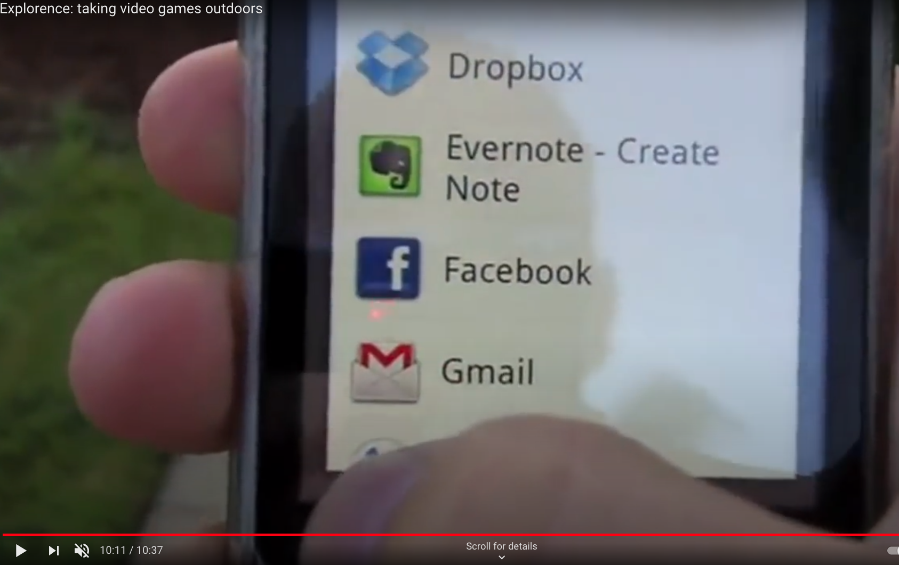
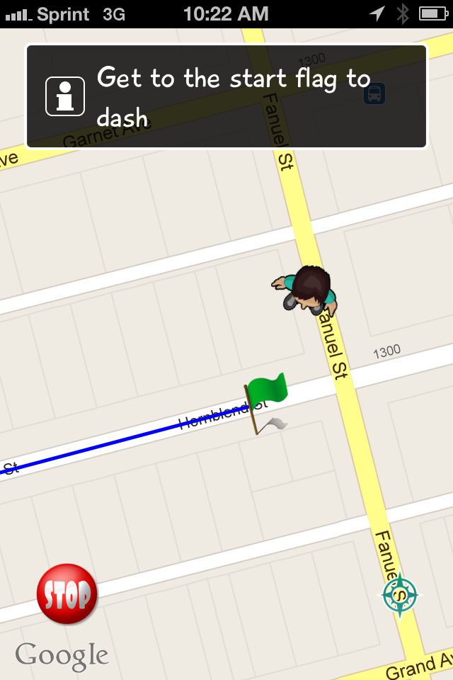

# Explorence

The vision of Explorence was to "bring the video game outside". At this moment in time, GPS-based apps were getting a lot of attention from the press and investors. I had been tinkering with Android for about a year before helping out Explorence with Android late 2010. In early 2011, I was invited to join as co-founder. 

We started with Android early on (2011) because we believed it was gonna breakout. We shifted to iOS due to simple forces: Android was still way behind iOS technology wise, more importantly, iOS owned the mobile startup realm at this moment in time.

```
├── CrittersInc     // an iOS-only title released in 2013
├── Dash            // series of iOS titles released in 2012
│   ├── BullDash    // iOS title released summer 2012
│   ├── DemonDash   // iOS title release october 2012
│   ├── StreetDash  // Android title never released 2011
│   └── TorchDash   // iOS title released summer 2012 
└── links
```

## DASH! - 2010 (Android)

DASH! on Android was the starting point for Explorence's GPS-based games, and was the first iteration of the Dash series of titles.  If the UI looks bad it's because I made it, and we didn't have a designer yet :) Also, most Android apps looked bad compared to iOS apps at this time. and can be seen here: [DASH! demo with the Scobelizer](https://www.youtube.com/watch?v=3-mdcn_YM6U) 

#### Screencaps

<p float="left">
  
   
  
    
</p>

#### Live demo screen caps from Scobelizer interview

<p float="left">
  
   
  
    
    
    
    
</p>

A core feature of DASH! was using GPS to create "challenges", and then allow the user to share a GPS track with friends. To get the GPS tracking off the ground, we pretty much hacked the open source Android project [MyTracks](https://en.wikipedia.org/wiki/MyTracks). The GPS data was stored in the GPX format locally on the Android device, and then shared to our server.
## StreetDash - 2011 (Android)

The second iteration of DASH! was StreetDash. It had a much better UI due to the fact we brought on an artist to help with UI. (This may have been released on the Google Play Store but I can't remember, if it was released, it wasn't live very long).

#### Mockup and flow

<p float="left">
  
</p>

#### App screenshots

<p float="left">
  
  
  
  
  
</p> 

## Dash 2012 titles (iOS)
The summer of 2012 was unique because the running of the bulls in Pamplona, Spain coincided with the 2012 Summer Olympics. We tried to capitalize on this by releasing BullDash, and then, TorchDash. TorchDash's artwork inspiration was the classic Greek Olympics. DemonDash was a zombie/demon inspired app, released around Halloween 2012. 

### BullDash - 2012 (iOS)
WIP

### TorchDash -2012 (iOS)

WIP

### DemonDash - 2012 (iOS)
 
WIP

